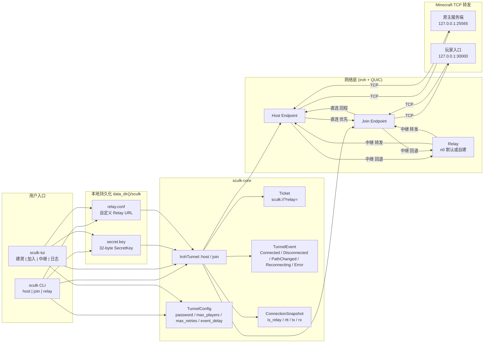
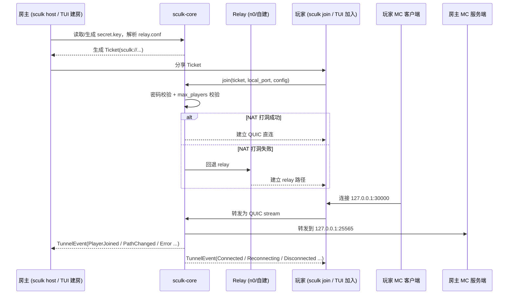
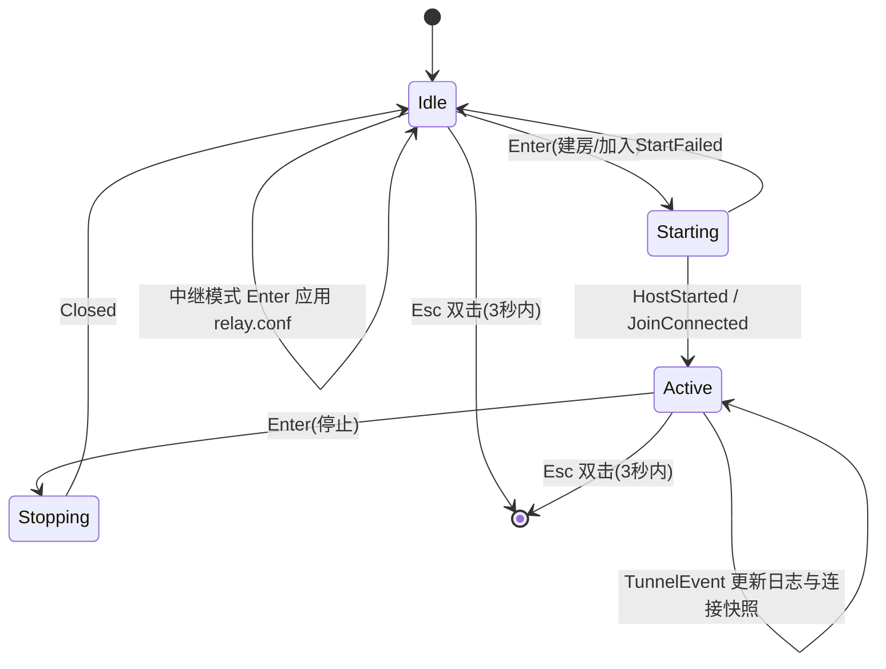

# sculk

一个面向 Minecraft 联机的 P2P 隧道项目，基于 iroh/QUIC，提供：
- `sculk`：命令行客户端（CLI）
- `sculk-tui`：终端图形客户端（TUI）
- `sculk-core`：可复用隧道核心库

> 项目名来自 Minecraft 的幽匿（Sculk）。

## 项目结构

这是一个 Rust workspace：

- `core` (`sculk-core`)：隧道能力与票据协议
  - `IrohTunnel::host/join`
  - `Ticket`（`sculk://...`）
  - `TunnelConfig` / `TunnelEvent`
- `cli` (`sculk-cli`)：`sculk` 命令行入口
  - 建房、加入、中继配置管理
- `tui` (`sculk-tui`)：`ratatui + crossterm` 终端界面
  - 建房/加入/中继三面板 + 日志 + 状态栏

## 工作原理

`host` 端把本地 MC 服务端（默认 `25565`）暴露为可分享票据；
`join` 端把远端隧道映射到本地端口（默认 `30000`），MC 客户端连本地即可。
链路优先直连（NAT 打洞），失败回退 relay。

### 系统架构全景



### 建房/加入时序



### TUI 状态机



## 安装

### 方式一：一键脚本（推荐）

#### macOS / Linux

```sh
curl -fsSL https://raw.githubusercontent.com/SeaLantern-Studio/sculk/main/scripts/install/install.sh | sh
```

#### Windows PowerShell

```powershell
irm https://raw.githubusercontent.com/SeaLantern-Studio/sculk/main/scripts/install/install.ps1 | iex
```

脚本会交互式询问安装：
1. `sculk`
2. `sculk-tui`
3. 全部

### 方式二：从源码安装

```sh
cargo install --path cli
cargo install --path tui
```

## 卸载

### 一键脚本

#### macOS / Linux

```sh
curl -fsSL https://raw.githubusercontent.com/SeaLantern-Studio/sculk/main/scripts/uninstall/uninstall.sh | sh
```

#### Windows PowerShell

```powershell
irm https://raw.githubusercontent.com/SeaLantern-Studio/sculk/main/scripts/uninstall/uninstall.ps1 | iex
```

### Cargo 卸载（注意包名）

```sh
cargo uninstall sculk-cli
cargo uninstall sculk-tui
```

> 二进制名是 `sculk`，但 Cargo 包名是 `sculk-cli`。

## CLI 使用

### 建房

```sh
sculk host -p 25565
```

常用参数：
- `--new-key`：强制生成新密钥（ticket 会变）
- `--key-path <PATH>`：自定义密钥路径
- `--relay <URL>`：覆盖 relay（优先级高于配置文件）
- `--password <PWD>`：连接密码
- `--max-players <N>`：最大玩家数

### 加入

```sh
sculk join "sculk://..." -p 30000
```

常用参数：
- `--password <PWD>`：加入密码
- `--max-retries <N>`：最大重连次数（不传=无限）

### 中继配置

```sh
sculk relay --list
sculk relay --url https://your-relay.example.com
sculk relay --reset
```

优先级：命令行 `--relay` > 配置文件 > 默认 n0 relay。

## TUI 使用

```sh
sculk-tui
```

默认三模式：`建房 / 加入 / 中继`

主要按键：
- `←/→`：切换模式（边界钳制，不循环）
- `Tab`：切换焦点（左侧配置/右侧日志）
- `↑/↓`：
  - 左侧：切字段或中继项
  - 右侧：日志上下滚动（边界钳制）
- `Enter`：执行主动作
  - 建房/加入：启动或停止隧道
  - 中继：应用选中中继
- `e`：进入编辑模式
- `q`：退出编辑模式（中继 URL 会应用）
- `h`：开关帮助
- `Esc`：3 秒内连按两次退出
- `c`：清空日志

## 配置与数据目录

默认位于系统 `data_dir()/sculk`：
- `secret.key`：私钥文件
- `relay.conf`：自定义中继地址

说明：
- 私钥持久化后，ticket 可跨重启保持稳定
- `--new-key` 会重置身份并改变 ticket

## 开发

### 环境

- Rust `1.91.1`
- `just`（命令管理）
- `cargo-nextest`（测试）

```sh
cargo install just just-lsp
cargo install cargo-nextest --locked
```

### 常用命令

```sh
just check          # fmt + check + clippy
just test           # 与 CI 对齐（离线优先）
just test-e2e       # 网络集成测试
just test-all       # 全量测试
just fmt            # 格式化
just doc            # 生成文档

just install        # 安装 sculk
just install-tui    # 安装 sculk-tui
just install-all    # 安装全部
just uninstall      # 卸载 sculk-cli
just uninstall-tui  # 卸载 sculk-tui
just uninstall-all  # 卸载全部
```

## 发布产物

Release 会同时构建两个客户端（`sculk` + `sculk-tui`）：

- Linux amd64：`sculk-linux-amd64` / `sculk-tui-linux-amd64`
- macOS amd64：`sculk-darwin-amd64` / `sculk-tui-darwin-amd64`
- macOS arm64：`sculk-darwin-arm64` / `sculk-tui-darwin-arm64`
- Windows amd64：`sculk-windows-amd64.exe` / `sculk-tui-windows-amd64.exe`

## 网络与 NAT 说明

- 理想路径：直连（延迟更低）
- 兜底路径：relay（可用性更高，延迟通常更高）

经验上：
- 家宽/IPv6 环境更容易直连
- 双方都在严格对称 NAT 时通常只能走 relay

可用 `iroh doctor report` 观察 NAT 情况（例如 `mapping_varies_by_dest_ip`）。

## 许可证

[GPL-3.0](LICENSE)
